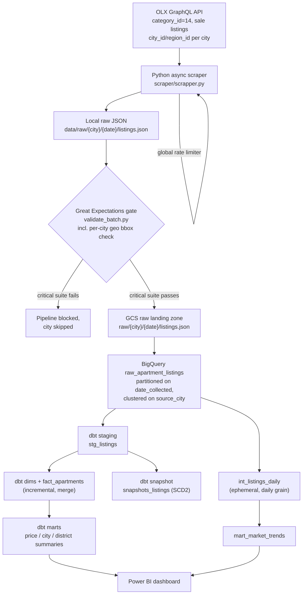
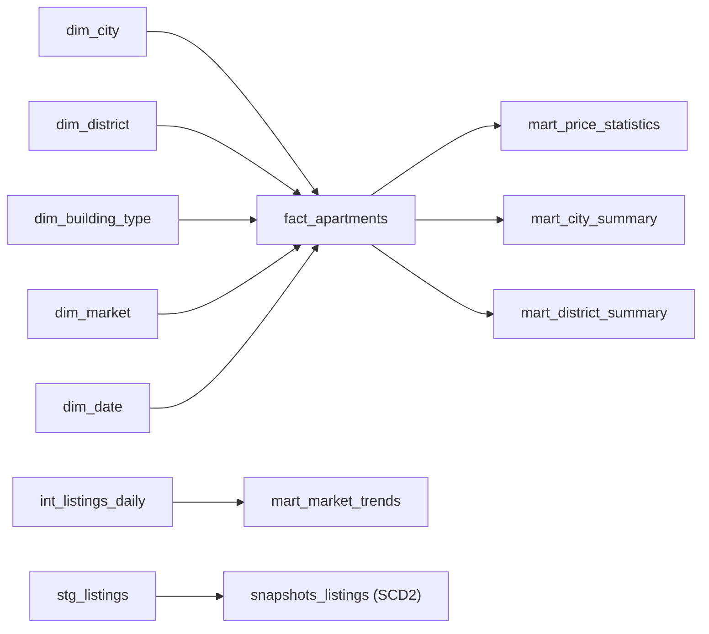
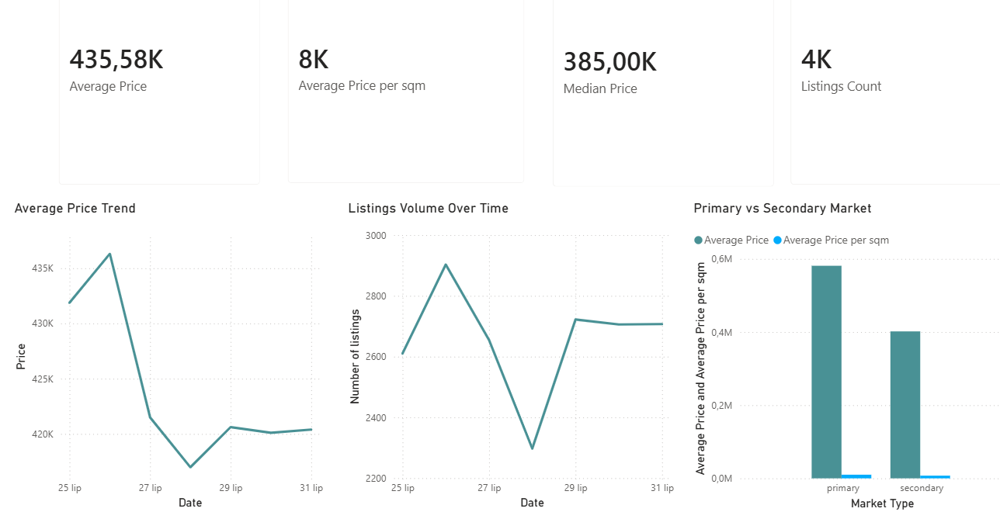
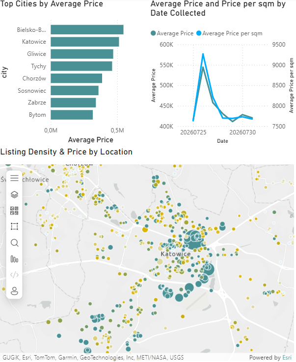

# Polish Housing Market Intelligence Platform

End-to-end data engineering pipeline for Poland's residential real estate market — built as a production-style portfolio project, not a tutorial. Covers ingestion, orchestration, infrastructure-as-code, data quality, dimensional modeling, CI/CD, and BI reporting for **34 cities spanning 16 voivodeships**, scoped up from an original 8-city Silesian MVP to national coverage.

[](https://github.com/kromylodd/Silesia-Housing-Data-Platform/actions/workflows/ci.yml)
[](https://github.com/kromylodd/Silesia-Housing-Data-Platform/actions/workflows/deploy-batch-job.yml)
[](https://kromylodd.github.io/Silesia-Housing-Data-Platform/)

**Status: Stage 1 and Stage 2 complete.** Scraper (async, location-ID-based, globally rate-limited) → Great Expectations → GCS → BigQuery raw → dbt (staging → dims/fact → marts, snapshots, tests, incremental fact table) → CI/CD on Workload Identity Federation → Cloud Run + Cloud Scheduler (daily production run, 34 cities) → Power BI are all built, tested, and running against live data. See [Known Limitations](#known-limitations--honest-caveats) for what's still rough around the edges.

## Table of Contents

- [Motivation](#motivation)
- [Current Progress](#current-progress)
- [Tech Stack](#tech-stack)
- [Architecture](#architecture)
- [Project Structure](#project-structure)
- [Pipeline Walkthrough](#pipeline-walkthrough)
- [Production Scheduling: Cloud Run + Cloud Scheduler](#production-scheduling-cloud-run--cloud-scheduler)
- [Data Model (Star Schema)](#data-model-star-schema)
- [dbt: Snapshots & Tests](#dbt-snapshots--tests)
- [CI/CD](#cicd)
- [Dashboard (Power BI)](#dashboard-power-bi)
- [Example SQL Queries](#example-sql-queries)
- [Target Cities & Known Data Quality Notes](#target-cities--known-data-quality-notes)
- [Scraping Ethics](#scraping-ethics)
- [Running Locally](#running-locally)
- [Local dbt Auth Setup (No Static Keys)](#local-dbt-auth-setup-no-static-keys)
- [Testing](#testing)
- [Known Limitations / Honest Caveats](#known-limitations--honest-caveats)
- [Roadmap / Future Improvements](#roadmap--future-improvements)
- [A Note on the Rename](#a-note-on-the-rename)
- [Disclaimer](#disclaimer)

## Motivation

Most portfolio ETL projects stop at "scrape and dump to CSV." This one is built the way a real internal analytics platform at a real estate company would be: validated ingestion with a hard quality gate, infrastructure defined entirely as code, a guaranteed daily production run regardless of whether a laptop is on, a proper Kimball-style star schema with incremental loading, CI enforcing lint/tests/data-quality on every push through keyless auth (Workload Identity Federation), and a BI layer on top. The project started as an 8-city Silesian MVP to prove the architecture end-to-end before paying the cost of scale; Stage 2 expanded coverage to 34 cities across nearly every voivodeship in Poland, so the scope is now genuinely national rather than regional. Stretch features (ML pricing, geospatial distance analysis) are documented in the [Roadmap](#roadmap--future-improvements) rather than chased prematurely.

## Current Progress

| Layer | Status |
|---|---|
| Scraper (OLX GraphQL, async, per-city pagination) | ✅ Done |
| **Location-ID-based city search** (`scraper/olx_location_ids.csv`), replacing free-text query matching | ✅ Done |
| **Global cross-city rate limiter** (`scraper/rate_limiter.py`) — concurrency + pacing decoupled | ✅ Done |
| **Authoritative pagination stop condition** (`metadata.total_elements`, with short-page fallback) | ✅ Done |
| Parser (typed field extraction, PL-language normalization) | ✅ Done |
| Local raw storage (partitioned by city/date) | ✅ Done |
| Terraform (GCS bucket, BigQuery datasets, service accounts, IAM) | ✅ Done |
| Great Expectations gate (critical + warning suites, **per-city geo bounding-box check**, unit tested) | ✅ Done |
| GCS raw landing zone | ✅ Done |
| Airflow DAG (scrape → validate → upload → load → `dbt build`, local/dev orchestrator) | ✅ Done (still 8-city list — see [Known Limitations](#known-limitations--honest-caveats)) |
| BigQuery raw table (`raw_apartment_listings`, partitioned + clustered) | ✅ Done |
| dbt staging layer (`stg_listings`) | ✅ Done |
| dbt dimensional model (5 dims + `fact_apartments`) | ✅ Done |
| dbt marts (price stats, city/district summaries, market trends) | ✅ Done |
| dbt snapshots (SCD Type 2 on price + `listing_status`) | ✅ Done |
| dbt schema tests + 5 custom singular tests (incl. `assert_geo_within_city_bounds`) | ✅ Done |
| `fact_apartments` incremental materialization (merge strategy) | ✅ Done |
| Continuous scheduling: Cloud Run Job + Cloud Scheduler (24/7 production, 34 cities) | ✅ Done |
| GitHub Actions on Workload Identity Federation (no static SA keys, both workflows) | ✅ Done |
| GitHub Actions CI (lint, test, docker-build, dbt build) | ✅ Done |
| GitHub Actions CD (image build + Cloud Run Job deploy on push to main) | ✅ Done |
| `dbt docs generate` published to GitHub Pages on every `main` push | ✅ Done |
| Power BI dashboard (2 pages, 12 DAX measures, ArcGIS map, 34-city geo now clean) | ✅ Done |
| Airflow `on_failure_callback` → Discord webhook | ✅ Done, verified live |
| **34-city expansion** (seed, `dim_city`, Terraform timeout, `relationships` tests) | ✅ Done |
| README rewrite + rename (this update) | ✅ Done |
| Full national coverage / ML price prediction / geospatial distance features | ⬜ Not started (see Roadmap) |

## Tech Stack

| Category | Tools |
|---|---|
| Language | Python 3.12 |
| Warehouse | Google BigQuery |
| Storage | Google Cloud Storage |
| Orchestration (dev/demo) | Apache Airflow 2.10.5 (Docker Compose, LocalExecutor + Postgres) |
| Orchestration (prod) | Cloud Scheduler → Cloud Run Job |
| HTTP client | httpx (async) |
| Data Quality | Great Expectations 1.19.1 (fluent/code-first API) |
| Transformation | dbt-core + dbt-bigquery, dbt-utils 1.3.0 |
| Infra as Code | Terraform (GCS remote state + locking) |
| Containerization | Docker / Docker Compose |
| CI/CD | GitHub Actions + Workload Identity Federation |
| Visualization | Power BI Desktop (ArcGIS Maps for Power BI) |

## Architecture



Orchestration runs on two independent tracks that both drive the same pipeline code:

- **Prod (24/7, guaranteed run):** Cloud Scheduler wakes a Cloud Run Job once a day (03:00 Europe/Warsaw), independent of whether Daniil's machine is on. Runs all 34 cities.
- **Dev/demo (manual control):** the Airflow DAG in Docker Compose, with a full UI, retries, and the ability to run a subset of cities via the `cities` Param. Currently still scoped to the original 8 MVP cities — see [Known Limitations](#known-limitations--honest-caveats).

All GCP infrastructure (bucket, datasets, service accounts, IAM, Cloud Run Job, Cloud Scheduler, Workload Identity Federation) is provisioned via Terraform — nothing is created manually in the console.

## Project Structure

```
housing-data-platform/
├── scraper/
│   ├── scrapper.py               # async per-city scraping (OLX GraphQL), global rate limiter
│   ├── rate_limiter.py            # GlobalRateLimiter — concurrency + pacing, shared across all cities
│   ├── olx_location_ids.csv        # source_city -> city_id, region_id (precise search, no free-text)
│   ├── location_id_builder.py       # builds olx_location_ids.csv from captured OLX location responses
│   ├── parser.py                     # flatten + type raw GraphQL items, PL-value normalization
│   ├── loader.py                      # write partitioned local raw JSON
│   ├── gcs_uploader.py                 # push validated batch to GCS
│   ├── bq_loader.py                     # load GCS batch into BigQuery raw table
│   ├── requirements.txt
│   └── tests/
│       ├── test_parser.py
│       └── test_rate_limiter.py
├── great_expectations/
│   ├── validate_batch.py          # critical + warning suites, per-city geo bbox check
│   └── tests/
├── airflow/
│   ├── dags/
│   │   └── housing_pipeline_dag.py    # dev/demo orchestrator: per-city chain + dbt_build (8 cities)
│   └── plugins/
│       └── callbacks.py             # Discord on_failure_callback
├── cloud_run_job/
│   ├── run_daily_pipeline.py       # prod entrypoint: same chain, all 34 cities, + dbt build --target cloud_run
│   ├── Dockerfile                    # image for the Cloud Run Job (bakes dbt deps in at build time)
│   └── requirements.txt
├── docker/
│   └── airflow/
│       ├── Dockerfile               # apache/airflow:2.10.5-python3.12 + GCP deps
│       └── requirements.txt
├── docker-compose.yml                 # postgres + airflow-init + webserver + scheduler
├── terraform/
│   ├── providers.tf / versions.tf (remote state: GCS backend + locking) / apis.tf
│   ├── variables.tf / outputs.tf / terraform.tfvars.example
│   ├── storage.tf                     # GCS raw bucket, 90-day lifecycle
│   ├── bigquery.tf                     # raw / staging / marts datasets
│   ├── iam.tf                           # ingestion + dbt + batch + scheduler + ci-deploy SAs, least-privilege IAM
│   ├── artifact_registry.tf              # image repo for the Cloud Run Job
│   ├── cloud_run_job.tf                   # Cloud Run Job housing-daily-batch, 7200s timeout (34-city scale)
│   ├── cloud_scheduler.tf                  # Cloud Scheduler → Cloud Run Admin API (:run)
│   └── workload_identity.tf                 # WIF pool/provider for GitHub Actions
├── dbt/
│   ├── dbt_project.yml
│   ├── profiles.yml                    # dev (oauth + impersonation) and cloud_run (ADC) targets, no static keys
│   ├── packages.yml                     # dbt_utils 1.3.0
│   ├── macros/
│   │   └── get_custom_schema.sql         # maps +schema to Terraform datasets exactly, no suffixing
│   ├── seeds/
│   │   └── city_lookup.csv                # 34 cities: source_city, display name, voivodeship, is_mvp, bbox_*
│   ├── snapshots/
│   │   └── snapshots_listings.sql          # SCD2 on price + listing_status
│   ├── tests/
│   │   ├── assert_price_within_bounds.sql
│   │   ├── assert_area_within_bounds.sql
│   │   ├── assert_price_per_sqm_consistent.sql
│   │   ├── assert_mart_city_summary_reconciles.sql
│   │   └── assert_geo_within_city_bounds.sql    # per-city bbox re-check, currently severity=warn (see Limitations)
│   └── models/
│       ├── staging/
│       │   ├── _staging__sources.yml / _staging__models.yml
│       │   └── stg_listings.sql
│       ├── intermediate/
│       │   └── int_listings_daily.sql       # ephemeral, daily grain for the market-trend mart
│       └── marts/
│           ├── dim_city.sql / dim_district.sql / dim_building_type.sql
│           ├── dim_market.sql / dim_date.sql
│           ├── fact_apartments.sql             # incremental, merge on listing_key
│           └── mart_price_statistics.sql / mart_city_summary.sql
│               mart_district_summary.sql / mart_market_trends.sql
├── docs/
│   └── screenshots/                   # Power BI dashboard screenshots, embedded below
├── pyproject.toml                       # ruff + black config, line-length 100
└── .github/workflows/
    ├── ci.yml                           # lint, test, docker-build, dbt build, dbt docs, deploy-docs — via WIF
    └── deploy-batch-job.yml              # build image + deploy Cloud Run Job — via WIF
```

## Pipeline Walkthrough

### Scraper (`scraper/scrapper.py`)
Queries OLX's GraphQL search endpoint (`ListingSearchQuery`, `category_id: 14` for sale listings) per city, asynchronously across all 34 cities at once. Each city looks itself up in `olx_location_ids.csv` and searches by resolved `city_id`/`region_id` rather than a free-text `query` string — this is what eliminated most of the fuzzy text-match noise that used to bleed neighboring-city listings into a target city's results. A city missing from the CSV falls back to free-text search rather than failing, so a stale mapping degrades one city instead of the whole batch.

Pagination within a city stops on the API's own `metadata.total_elements` count rather than "this page came back short" — OLX's relevance-ordering reshuffles results between offset pages, so a short page doesn't reliably mean the end of the result set, and using it as the sole stop condition both under-counted some cities and over-counted others before this fix. The old short-page check is kept as a fallback only for the rare case `total_elements` comes back null or zero. If `max_pages` is exhausted before `total_elements` is satisfied, a warning is logged rather than silently truncating.

A single malformed listing is caught and skipped per-item (deliberately broad `except Exception` — ruff's `BLE001` is silenced for this file for that reason, see [Known Limitations](#known-limitations--honest-caveats)) rather than killing the whole city's run. Logging runs through the `logging` module rather than `print()`.

### Global rate limiter (`scraper/rate_limiter.py`)
As the city list grew from 8 to 34, naive per-city concurrency would multiply the actual request rate hitting OLX by however many cities run at once — the opposite of "ethical, rate-limited scraping." `GlobalRateLimiter` decouples two concerns across *all* cities combined: `max_concurrent` bounds how many requests are in flight at once, and `min_interval` enforces the minimum wall-clock gap between any two requests being dispatched, regardless of which city's coroutine is asking. The result: OLX sees roughly the same request cadence as the original sequential 8-city scraper, no matter how many cities run concurrently — concurrency buys parallel *waiting* on network I/O, not a higher hit rate on the source.

### Parser (`scraper/parser.py`)
Flattens OLX's nested `params` array into a typed record. Handles Polish-language values at the source (area strings like `"48,5 m²"` → `48.5`, top-coded categories like `"4 i więcej"` / `"Powyżej 10"` → capped numeric value + a `rooms_capped`/`floor_capped` boolean so the topcoding is never silently lost), and computes `price_per_sqm_listed` directly from OLX's own fields for later cross-validation.

### Loader (`scraper/loader.py`)
Writes parsed listings to a locally partitioned directory (`data/raw/{city}/{date}/listings.json`) — the shared handoff point for Great Expectations, the GCS uploader, and local debugging.

### Great Expectations gate (`great_expectations/validate_batch.py`)
Sits between the local raw write and the GCS upload. Two suites, run against every city's batch:
- **Critical suite** (blocks the pipeline on failure): ID not-null/uniqueness, price bounds (1–20,000,000 PLN), area bounds (10–500 m²), room count bounds (1–10, `mostly=0.95`), boolean honesty on the topcoded fields, valid `market_type`, a cross-field check that OLX's listed price/m² agrees with `price / area_sqm` within 5%, and a **per-city latitude/longitude bounding-box check** sourced from `city_lookup.bbox_*` — catches a listing that comes back for city X's search but is actually located nowhere near X. Scoped per-city rather than one national box, since a national box would never catch a same-region mismatch (e.g. a Warszawa listing bleeding into a Radom batch). Null lat/lon and cities with no known bbox skip this check gracefully rather than failing the batch.
- **Warning suite** (logged, never blocks): `district` not-null rate. Deliberately informational — a real Katowice run showed ~40% missing, which is a property of the source data, not a scraper bug.

Bad rows within a batch are quarantined individually (dropped, not the whole city) up to `QUARANTINE_MAX_FRACTION`; a larger failure rate still hard-fails the city, since that indicates a systemic parsing bug rather than a few outliers.

Code-first, no persisted GX project, since it runs inside a scheduled container.

### GCS uploader (`scraper/gcs_uploader.py`)
Uploads a validated city's local raw file to the GCS landing zone (`raw/{city}/{date}/listings.json`), only after the GE critical suite passes.

### BigQuery loader (`scraper/bq_loader.py`)
Reads the just-uploaded GCS blob (not the local file, so BigQuery mirrors exactly what's in the landing zone) and appends it into `raw_apartment_listings`. Table is created on first run, partitioned daily on `date_collected`, clustered on `source_city`, `WRITE_APPEND`.

### Airflow DAG (`airflow/dags/housing_pipeline_dag.py`)
One `scrape → validate → upload → load_bq` chain per city, scheduled `@daily` with `catchup=False`, followed by a single `dbt_build` task that runs once all cities' load tasks finish. Exposes a `cities` Param on the Trigger UI form so a subset can be run on demand. All task functions derive their working date from Airflow's logical date (`kwargs["ds"]`), not wall-clock time, so a manually-triggered run reads and writes the same day's partition consistently across every task. Remains the dev/demo orchestrator with a full task-level UI, retries, and observability — the production path is a separate track (see below). A DAG-level `on_failure_callback` posts to Discord when the run's final state resolves to failed — this is now confirmed working in practice, not just wired.

**This DAG's city list is still the original 8-city MVP set**, not the 34-city Stage 2 expansion used by the Cloud Run production path — see [Known Limitations](#known-limitations--honest-caveats).

### Infrastructure (`terraform/`)
Provisions the GCS raw bucket (90-day lifecycle), three BigQuery datasets (`raw_housing`, `staging_housing`, `marts_housing`), and five service accounts with least-privilege IAM: ingestion, dbt, batch (Cloud Run Job runtime identity), scheduler (invoke-only), and a CI deploy identity. Terraform state lives in a GCS remote backend with native locking, so `terraform apply` is safe to run from any machine.

### dbt staging (`dbt/models/staging/stg_listings.sql`)
Sits on top of the `raw_apartment_listings` source, one row per listing deduplicated to its most recent scrape (`qualify row_number() over (partition by listing_id order by date_collected desc) = 1`, since raw is append-only and the same listing recurs across days). Standardizes city names via the `city_lookup` seed keyed on `source_city`, and applies a second, defensive price/area sanity filter on top of what GE already gated upstream.

### dbt dimensional model & marts
`fact_apartments` (one row per `listing_id`, current-state grain) joins to five dimensions via surrogate keys built with `dbt_utils.generate_surrogate_key`. It's materialized **incremental** with a `merge` strategy on `listing_key`, filtered to listings rescraped since the table's last successful load — this keeps scan cost roughly flat as `raw_apartment_listings` grows daily instead of rescanning the full history every run.

`mart_market_trends` is built from a separate ephemeral model, `int_listings_daily`, deliberately not `stg_listings` — staging collapses to latest-scrape-only, which would flatten every trend point to the same value; `int_listings_daily` reads straight from the append-only raw table so each scrape day keeps its own row.

## Production Scheduling: Cloud Run + Cloud Scheduler

Before this was added, the only way to run the pipeline was the Airflow scheduler inside Docker Compose on a personal machine. Because of `catchup=False`, daily triggers missed while the laptop was off weren't backfilled (and backfilling isn't actually possible anyway — OLX only returns currently-live listings). The result was trend marts not accumulating daily history.

The fix is a guaranteed production path with no always-on host required:

- **Artifact Registry** (`housing-batch-job`) holds the production job image.
- **Cloud Run Job** `housing-daily-batch` (1 vCPU / 1 Gi, **7200s timeout** — sized for 34 cities' worth of globally rate-limited scraping plus `dbt build`, up from 3600s when the job only covered 8 MVP cities) runs under a dedicated SA, `housing-batch-sa`.
- **Cloud Scheduler** job `housing-daily-batch-trigger` calls the Cloud Run Admin API `:run` endpoint daily at 03:00 (Europe/Warsaw) via its own `housing-scheduler-sa` with `roles/run.invoker` only.
- **`cloud_run_job/run_daily_pipeline.py`** — scrapes all **34 cities** concurrently in Phase 1 (one shared rate limiter), then runs the validate/upload/load chain sequentially per city in Phase 2, catching and logging per-city failures so one bad city doesn't take down the rest, then runs `dbt build --target cloud_run`.
- **`.github/workflows/deploy-batch-job.yml`** — on push to `main` touching pipeline code, builds the image and rolls it out via `gcloud run jobs update`, under `housing-ci-deploy-sa`.
- `terraform/cloud_run_job.tf` uses `lifecycle.ignore_changes` on the container image, so after the first bootstrap deploy CI (not `terraform apply`) owns the deployed image.

Why not an e2-micro VM, a GitHub Actions cron, or Cloud Composer: Composer costs ~$400/month idle, GH Actions cron is less reliable and bound to runner quotas, and a VM needs its own patching upkeep. Cloud Run Job + Scheduler is near-zero idle cost with no infrastructure to maintain.

The Airflow DAG was neither removed nor changed — it remains the orchestrator for manual/demo runs.

## Data Model (Star Schema)



**`fact_apartments`** — one row per listing: `price`, `area_sqm`, `price_per_sqm_calculated`, `num_rooms` (+ `rooms_capped`), `floor` (+ `floor_capped`), `is_furnished`, `extra_rent_pln`, lat/long, plus FKs to all five dimensions.

**`dim_city`** — one row per distinct city seen in `stg_listings` (34 as of Stage 2), enriched with `voivodeship` and an `is_mvp` flag (`true` for the original 8 Silesian cities) via the `city_lookup` seed.

All FK relationships are enforced with dbt `relationships` tests pointing at `city_lookup` as the single source of truth (replacing the earlier `accepted_values` hardcoded list, which would have needed a manual update for every new city), and every dimension's surrogate key has `unique` + `not_null` tests.

## dbt: Snapshots & Tests

**Snapshot (`dbt/snapshots/snapshots_listings.sql`)** — SCD Type 2 on top of `stg_listings`, `check` strategy on `[price, listing_status]`. `listing_status` is a derived field (`active` / `likely_removed` based on `date_collected` recency vs. `current_date`), since OLX's API has no real listing-status field.

**Custom singular tests (`dbt/tests/`)** — 5 of them:
- `assert_price_within_bounds.sql` / `assert_area_within_bounds.sql` — defense-in-depth on top of what Great Expectations already blocks on ingestion.
- `assert_price_per_sqm_consistent.sql` — mirrors GE's 5% cross-field tolerance check.
- `assert_mart_city_summary_reconciles.sql` — row-count reconciliation between `mart_city_summary` and `stg_listings`.
- `assert_geo_within_city_bounds.sql` — defense-in-depth re-check of the same per-city bbox GE already enforces pre-load, catching any future ingestion path that bypasses GE, or a bbox edited in the seed without a matching GE deploy. **Currently `severity='warn'`, not the default `error`** — see [Known Limitations](#known-limitations--honest-caveats).

Plus standard schema tests (`unique`, `not_null`, `relationships`, `accepted_values`) across all models. `dbt build` runs green against live BigQuery data.

## CI/CD

Both workflows authenticate via **Workload Identity Federation** — no static JSON service-account keys exist in GCP or as GitHub secrets. `google-github-actions/auth@v2` exchanges a GitHub OIDC token for short-lived GCP credentials on every run, scoped to this repo only.

**`.github/workflows/ci.yml`** — six jobs on every push/PR to `main`:

| Job | What it does |
|---|---|
| `lint` | `ruff check .` + `black --check .` |
| `test` | `pytest scraper/tests/` (parser, scraper, rate limiter unit tests) and `pytest great_expectations/tests/` |
| `docker-build` | Builds the Airflow image from `docker/airflow/Dockerfile` |
| `dbt` | `dbt build --target cloud_run` against real BigQuery, `needs: [lint, test]`, gated to `push` to `main` only |
| `dbt-docs` | `dbt docs generate --target cloud_run`, `needs: [dbt]`; uploads the static site as a Pages artifact |
| `deploy-docs` | Publishes that artifact to GitHub Pages, `needs: [dbt-docs]` |

Live dbt docs (lineage graph, column-level descriptions, source freshness): **https://kromylodd.github.io/Silesia-Housing-Data-Platform/**

**`.github/workflows/deploy-batch-job.yml`** — on push to `main` touching `cloud_run_job/`, `scraper/`, `great_expectations/`, or `dbt/`: builds the image, pushes it to Artifact Registry, and rolls out `gcloud run jobs update` under `housing-ci-deploy-sa`.

## Dashboard (Power BI)

Built in Power BI Desktop, connected to `marts_housing` in Import mode (`fact_apartments` + all 5 dimensions), with `fact_apartments.date_collected_key` → `dim_date.date_key` as the active relationship driving all time-series visuals. 12 DAX measures with custom number formats (e.g. `#,##0, "K"zł`) to keep price formatting locale-independent. Two pages:

**Overview** — KPI cards (average price, average price/m², median price, listings count), an average-price trend line, a listings-volume-over-time line, and a primary-vs-secondary-market comparison chart.


*Prices are in PLN with Polish number formatting (comma as decimal separator, e.g. `435,00K` = 435 thousand PLN).*

**Market & Geo** — a Top Cities by average price bar chart, an average-price-and-price-per-sqm-by-date-collected dual-axis line chart, and apartment locations plotted with the ArcGIS Maps for Power BI visual (used instead of Azure Maps, which requires a Microsoft work/school account Daniil doesn't have). Now covering all 34 cities with materially less location noise than before the location-ID scraping fix.


*Listing density and pricing across all 34 target cities.*

A teal/gold Power BI theme is applied for consistent coloring across bars, lines, and the map.

## Example SQL Queries

Most expensive districts by average price/m² (excludes the `Unknown` sentinel):

```sql
select city, district, avg_price_per_sqm, rank_most_expensive
from `silesia-housing-data-platform.marts_housing.mart_district_summary`
where district != 'Unknown'
order by rank_most_expensive
limit 10;
```

Month-over-month price trend, all cities combined:

```sql
select period_start, avg_price, price_change_pct
from `silesia-housing-data-platform.marts_housing.mart_market_trends`
where period_type = 'month'
order by period_start;
```

Average price per m² by voivodeship (national rollup, using `dim_city.voivodeship`):

```sql
select
    dim_city.voivodeship,
    count(*)                                                as num_listings,
    round(avg(fact_apartments.price_per_sqm_calculated), 2)  as avg_price_per_sqm
from `silesia-housing-data-platform.marts_housing.fact_apartments` as fact_apartments
join `silesia-housing-data-platform.marts_housing.dim_city` as dim_city
    on fact_apartments.city_key = dim_city.city_key
group by 1
order by 3 desc;
```

Price-change history for a single listing (SCD2 snapshot):

```sql
select listing_id, price, listing_status, dbt_valid_from, dbt_valid_to
from `silesia-housing-data-platform.staging_housing.snapshots_listings`
where listing_id = 123456789
order by dbt_valid_from;
```

## Target Cities & Known Data Quality Notes

34 cities across 16 voivodeships, from Warszawa and Kraków down to Elbląg and Zielona Góra — see `dbt/seeds/city_lookup.csv` for the full list, each flagged `is_mvp` (the original 8 Silesian cities) or not. Full details of every city's bounding box live in that same seed.

- **`city` vs. `source_city`:** OLX's search previously matched on free text, which let raw `city` values include bleed from neighboring metro areas. Switching to `city_id`/`region_id`-based search (via `olx_location_ids.csv`) eliminated most of this at the source; `source_city` remains the reliable field for filtering to a specific target city, and `stg_listings` still standardizes `city` via `city_lookup` as a second line of defense. Historical rows scraped before this fix may still carry some of the old noise — see the geo bbox test note below.
- **`district` nulls:** legitimately variable by city (~40% in a real Katowice run) — kept as a permanent warning-suite check rather than a hard-fail threshold, and modeled as `'Unknown'` in `dim_district` rather than dropped.
- **OLX's ~1,000-result pagination ceiling:** confirmed directly against the live API (`offset=1000` test) that `metadata.total_elements` itself reports exactly 1,000 for large metros like Warszawa and Kraków, despite Warszawa having roughly 4,000 real active sale listings. This is an artificial cap on OLX's side, not a true count, and it is **not fixable via pagination** — slicing queries by price bracket or date to work around it was considered and deliberately rejected as over-engineering for a portfolio project. For Warszawa, Kraków, and any other city whose true inventory exceeds ~1,000 listings, the data collected is a representative sample of that day's search results, not a full census. Smaller and mid-sized cities are unaffected.

## Scraping Ethics

- Only publicly visible listing metadata is collected via OLX's own GraphQL API — no authenticated endpoints, no HTML scraping.
- Requests are rate-limited globally across all cities combined (`scraper/rate_limiter.py`), not just per city, so the actual hit rate against OLX doesn't scale with the number of cities being scraped concurrently.
- Failed requests retry with exponential backoff rather than hammering the endpoint.
- No attempt is made to bypass access controls, CAPTCHAs, or ToS restrictions. Scope is limited to search-results-page fields only — no detail-page scraping.

## Running Locally

```bash
# 1. Provision GCP infrastructure
cd terraform
terraform init && terraform apply

# 2. Bring up Postgres + Airflow (webserver + scheduler)
cd ..
docker compose up -d

# 3. Open the Airflow UI at localhost:8080, trigger `housing_pipeline`
#    (optionally trim the `cities` param to run a subset)
#    Note: this DAG currently runs the original 8 MVP cities only.
#    This also runs `dbt build` as the final task in the DAG.

# 4. To run the full 34-city scrape standalone (outside Airflow), run
#    scraper/scrapper.py directly, or trigger the Cloud Run Job:
gcloud run jobs execute housing-daily-batch --region europe-central2

# 5. To run dbt standalone instead, see the dedicated auth setup below —
#    dbt no longer uses a static keyfile locally.

# 6. Connect Power BI Desktop to the marts_housing dataset via the BigQuery
#    connector (Import mode) to reproduce the dashboard.
```

**Regenerating `olx_location_ids.csv`** (only needed if adding a new target city): capture OLX's location-search JSON response for that city into `scraper/captures/`, then run `python scraper/location_id_builder.py` from the repo root — it matches every row in `city_lookup.csv` against the captured responses and flags any city still missing a mapping.

## Local dbt Auth Setup (No Static Keys)

Local dbt runs (outside the Airflow container) authenticate by impersonating `housing-dbt-sa` via `gcloud`'s Application Default Credentials — no service-account JSON key ever touches disk. This needs a one-time environment and IAM setup:

**1. Python environment.** The WSL host's default Python (3.14+) is too new for Great Expectations' fluent API and, separately, dbt-core wants a clean, pinned environment of its own. Create a dedicated Python 3.12 conda environment (via Miniconda, since python3.12 isn't available through apt/deadsnakes on newer Ubuntu releases yet):

```bash
conda create -n housing-dbt python=3.12
conda activate housing-dbt
pip install dbt-core dbt-bigquery
```

**2. gcloud ADC login and impersonation IAM.**

```bash
gcloud auth application-default login
```

For `dbt/profiles.yml`'s `dev` target (`method: oauth`, `impersonate_service_account: housing-dbt-sa@...`) to work, `housing-dbt-sa` needs `roles/iam.serviceAccountTokenCreator` granted **on itself** and **on your GCP user**, and the project needs the IAM Service Account Credentials API enabled:

```bash
gcloud services enable iamcredentials.googleapis.com
```

**3. Run dbt.**

```bash
cd dbt
export DBT_PROFILES_DIR=$(pwd)
export GCP_PROJECT_ID=silesia-housing-data-platform
export BQ_DATASET_STAGING=staging_housing
export GCP_REGION=europe-central2
dbt deps && dbt seed && dbt build
```

**The `.env` dotenv gotcha:** dbt-core auto-loads a `.env` file (`load_dotenv(find_dotenv(usecwd=True), override=False)`) on every invocation, walking up the directory tree from the current working directory. The repo-root `.env` originally set `GOOGLE_APPLICATION_CREDENTIALS` for the Docker Compose / Airflow container — dbt's auto-loader was silently picking that same variable up and injecting a path to a keyfile that doesn't exist locally, breaking oauth auth with a confusing "file not found" error unrelated to the real (oauth) auth path being used. Fixed by renaming the repo-root `.env` key to `AIRFLOW_GOOGLE_APPLICATION_CREDENTIALS` and mapping it back to `GOOGLE_APPLICATION_CREDENTIALS` only inside `docker-compose.yml`'s `environment:` block — so the container still gets the variable it needs, but a local `dbt` invocation never sees it. If you hit a `GOOGLE_APPLICATION_CREDENTIALS` / keyfile-not-found error while `profiles.yml`'s target uses `oauth`, this dotenv auto-load is the first thing to check.

## Testing

```bash
cd scraper
pip install -r requirements.txt
pytest tests/ -v

cd ../great_expectations
pytest tests/ -v
```

**Python version note:** Great Expectations 1.19's fluent API (`context.data_sources`) requires Python < 3.14. On a host with a newer default Python, `pip install great_expectations` silently falls back to an old pre-fluent release and breaks the GE tests — use a Python 3.12 environment (or run the tests inside the Airflow container, which is pinned to `apache/airflow:2.10.5-python3.12`) instead of fighting a bleeding-edge system Python.

## Known Limitations / Honest Caveats

Documented deliberately, not swept under the rug — a recruiter reading this should see engineering judgment about trade-offs, not just a list of green checkmarks.

- **OLX's ~1,000-result pagination cap** for the largest metros (Warszawa, Kraków, and likely a few others) means the daily scrape is a representative sample, not a full census, for those specific cities — see [Target Cities & Known Data Quality Notes](#target-cities--known-data-quality-notes). Not fixable via pagination; deliberately not worked around.
- **`assert_geo_within_city_bounds.sql` is currently `severity='warn'`, not `error`.** The first dbt build after adding this test (2026-08-02) surfaced ~974 pre-existing failures — historical rows loaded before the geo bbox check existed in `validate_batch.py`, likely a mix of genuine pre-fix OLX fuzzy-search noise and possibly some bounding boxes that are tighter than OLX's real search radius for a given city. Needs a per-city breakdown/triage before flipping back to the default `error`; going forward, GE already quarantines new bad rows individually at ingestion, so this warn-severity window only affects already-loaded historical rows, not new data.
- **The Airflow DAG's city list is out of sync with the 34-city Stage 2 expansion.** `airflow/dags/housing_pipeline_dag.py`'s `TARGET_CITIES` still hardcodes the original 8 MVP cities, while `cloud_run_job/run_daily_pipeline.py` (the production path) and `scraper/scrapper.py`'s `__main__` block both run all 34. The dev/demo orchestrator currently only demos the original MVP subset — either sync the DAG's list to the full 34 or document it as an intentional "lightweight demo" scope.
- **`dbt_project.yml` has redundant nested model config paths** (`models.silesia_housing.staging` duplicated under `models.silesia_housing.models.silesia_housing.*`) — harmless but throws an annoying config warning on every `dbt` invocation. Known cleanup item, not yet done.
- **Two ruff lint rules are deliberately suppressed project-wide** (`pyproject.toml`): `DTZ001`/`DTZ005` for naive `datetime.now()` calls used purely for date-partitioning inside a container that runs in UTC, and `BLE001` for the scraper's per-listing blind `except Exception` (one malformed OLX ad shouldn't kill a whole city's run). Both are documented trade-offs, not oversights.
- **`terraform/storage.tf` sets `force_destroy = true`** on the raw GCS bucket — a dev-convenience flag that would need to come out before this pattern was ever pointed at anything resembling a real production environment.
- **MVP scope is search-results-page fields only.** No detail-page scraping (construction year, parking, balcony, elevator, seller/agency info) — a deliberate scope boundary, not a gap to be quietly filled later without re-evaluating scraping load.
- **Trend history is still relatively short.** `mart_market_trends` and the dashboard's trend lines only have real daily data going back to when the Cloud Run + Cloud Scheduler production path went live (2026-07-29). Month-over-month / week-over-week growth measures will keep looking thin until more daily history accumulates.

## Roadmap / Future Improvements

**Stage 1 (Tier 1 + Tier 2): closed out.** Continuous scheduling, dbt snapshots, dbt schema + custom tests, GitHub Actions WIF, Terraform remote state, `print()` → `logging`, Discord failure notification (verified working), dbt docs on GitHub Pages, incremental `fact_apartments`.

**Stage 2: closed out.** 34-city expansion (seed, `dim_city`, Terraform timeout, `relationships` tests), async scraper with a global rate limiter, location-ID-based city search (replacing free-text matching), authoritative pagination stop condition, per-city geo bounding-box validation in both Great Expectations and dbt, this README rewrite and rename.

**Stage 2 cleanup, not yet done:**
- Sync (or intentionally retire) the Airflow DAG's 8-city list vs. the 34-city production scope
- Fix the redundant nested config path in `dbt_project.yml`

**Stage 3 (second portfolio project):**
- "Polish IT Job Market Intelligence" — IT job postings/salary aggregation, star schema, NLP parsing of tech stacks from job descriptions

**Deliberately out of scope (not committed roadmap items):**
- Detail-page scraping (construction year, parking, balcony, elevator, seller/agency info) — scope is search-results fields only
- ML price prediction model
- Geospatial analysis (distance to city center, schools, public transport; OpenStreetMap integration)
- Working around OLX's ~1,000-result pagination cap via price-bracket/date slicing

## A Note on the Rename

This project began as the **Silesia Housing Data Platform**, scoped to 8 cities in the Silesian Voivodeship. Stage 2 expanded coverage to 34 cities across 16 of Poland's voivodeships, so "Silesia Housing" no longer described the actual scope of the data — hence the rename to **Polish Housing Market Intelligence Platform**. This rename is a portfolio/branding change only: the GitHub repository path, GCP project ID (`silesia-housing-data-platform`), BigQuery dataset names, dbt project name, and DAG tags were **not** renamed, since that would mean re-provisioning GCP infrastructure and breaking existing links rather than just updating a title. A full technical rename is possible as a separate piece of work if desired.

## Disclaimer

This project scrapes only publicly available data for educational/portfolio purposes. It is not affiliated with OLX or Otodom.
