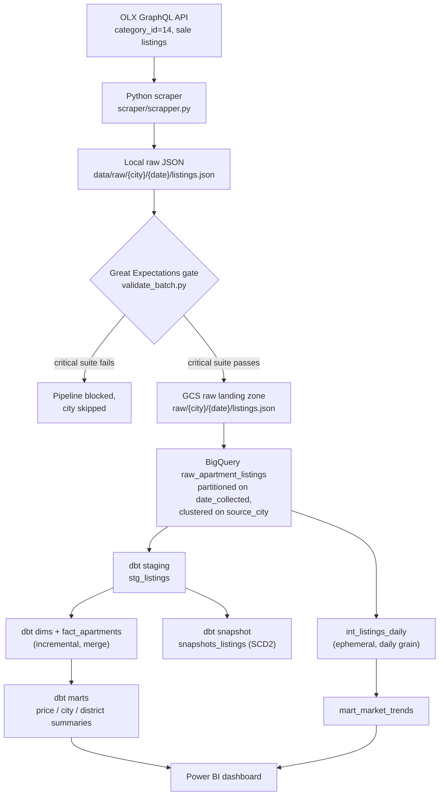
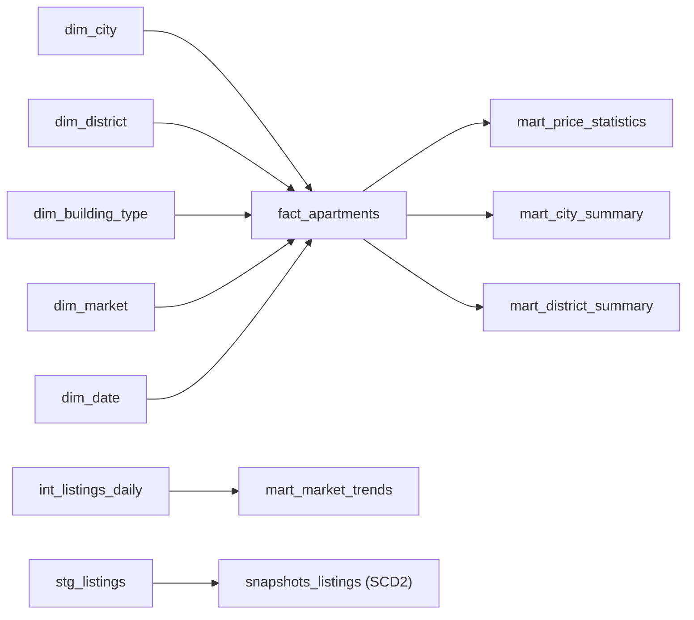
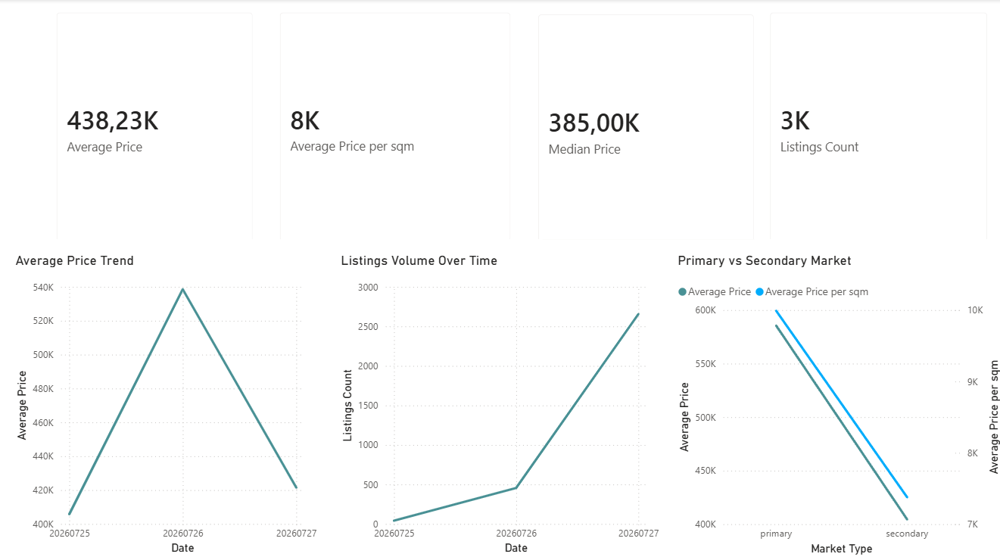
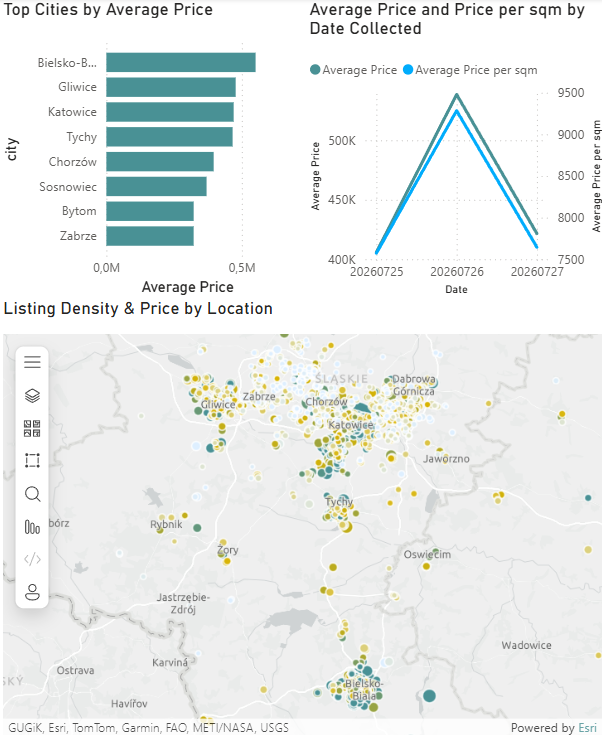

# Silesia Housing Data Platform

End-to-end data engineering pipeline for the residential real estate market in the Silesian Voivodeship, Poland — built as a production-style portfolio project, not a tutorial. Covers ingestion, orchestration, infrastructure-as-code, data quality, dimensional modeling, CI/CD, and BI reporting for eight major Silesian cities.

[](https://github.com/kromylodd/Silesia-Housing-Data-Platform/actions/workflows/ci.yml)
[](https://github.com/kromylodd/Silesia-Housing-Data-Platform/actions/workflows/deploy-batch-job.yml)
[](https://kromylodd.github.io/Silesia-Housing-Data-Platform/)

**Status: Stage 1 (Tier 1 + Tier 2) complete.** Scraper → Great Expectations → GCS → BigQuery raw → dbt (staging → dims/fact → marts, snapshots, tests, incremental fact table) → CI/CD on Workload Identity Federation → Cloud Run + Cloud Scheduler (daily production run) → Power BI are all built, tested, and running against live data. See [Known Limitations](#known-limitations--honest-caveats) for what's still rough around the edges.

## Table of Contents

- [Motivation](#motivation)
- [Current Progress](#current-progress)
- [Tech Stack](#tech-stack)
- [Architecture](#architecture)
- [Project Structure](#project-structure)
- [Pipeline Walkthrough](#pipeline-walkthrough)
- [Production Scheduling: Cloud Run + Cloud Scheduler](#production-scheduling-cloud-run--cloud-scheduler)
- [Data Model (Star Schema)](#data-model-star-schema)
- [dbt: Snapshots & Tests](#dbt-snapshots--tests)
- [CI/CD](#cicd)
- [Dashboard (Power BI)](#dashboard-power-bi)
- [Example SQL Queries](#example-sql-queries)
- [Target Cities & Known Data Quality Notes](#target-cities--known-data-quality-notes)
- [Scraping Ethics](#scraping-ethics)
- [Running Locally](#running-locally)
- [Local dbt Auth Setup (No Static Keys)](#local-dbt-auth-setup-no-static-keys)
- [Testing](#testing)
- [Known Limitations / Honest Caveats](#known-limitations--honest-caveats)
- [Roadmap / Future Improvements](#roadmap--future-improvements)
- [Disclaimer](#disclaimer)

## Motivation

Most portfolio ETL projects stop at "scrape and dump to CSV." This one is built the way a real internal analytics platform at a real estate company would be: validated ingestion with a hard quality gate, infrastructure defined entirely as code, a guaranteed daily production run regardless of whether a laptop is on, a proper Kimball-style star schema with incremental loading, CI enforcing lint/tests/data-quality on every push through keyless auth (Workload Identity Federation), and a BI layer on top. Scope is deliberately capped at 8 of Silesia's largest cities for the MVP — full regional coverage and stretch features (ML pricing, geospatial analysis) are documented in the [Roadmap](#roadmap--future-improvements) rather than chased prematurely.

## Current Progress

| Layer | Status |
|---|---|
| Scraper (OLX GraphQL, paginated, retry/backoff, `logging` instead of `print`) | ✅ Done |
| Parser (typed field extraction, PL-language normalization) | ✅ Done |
| Local raw storage (partitioned by city/date) | ✅ Done |
| Terraform (GCS bucket, BigQuery datasets, service accounts, IAM) | ✅ Done |
| Terraform remote state (GCS backend + native locking) | ✅ Done |
| Docker Compose (Airflow 2.10.5 webserver/scheduler + Postgres) | ✅ Done |
| Great Expectations gate (critical + warning suites, unit tested) | ✅ Done |
| GCS raw landing zone | ✅ Done |
| Airflow DAG (scrape → validate → upload → load → `dbt build`, local/dev orchestrator) | ✅ Done |
| BigQuery raw table (`raw_apartment_listings`, partitioned + clustered) | ✅ Done |
| dbt staging layer (`stg_listings`) | ✅ Done |
| dbt dimensional model (5 dims + `fact_apartments`) | ✅ Done |
| dbt marts (price stats, city/district summaries, market trends) | ✅ Done |
| dbt snapshots (SCD Type 2 on price + `listing_status`) | ✅ Done |
| dbt schema tests + 4 custom singular tests | ✅ Done |
| **`fact_apartments` incremental materialization (merge strategy)** | ✅ Done |
| Continuous scheduling: Cloud Run Job + Cloud Scheduler (24/7 production) | ✅ Done |
| GitHub Actions on Workload Identity Federation (no static SA keys, both workflows) | ✅ Done |
| GitHub Actions CI (lint, test, docker-build, dbt build) | ✅ Done |
| GitHub Actions CD (image build + Cloud Run Job deploy on push to main) | ✅ Done |
| **`dbt docs generate` published to GitHub Pages on every `main` push** | ✅ Done |
| Power BI dashboard (2 pages, 12 DAX measures, ArcGIS map) | ✅ Done |
| **Airflow `on_failure_callback` → Discord webhook** | ✅ Done |
| README rewrite (architecture diagram, screenshots, SQL examples, limitations) | ✅ Done (this update) |
| Full Silesian city list expansion | ⬜ Not started (Stage 2) |

## Tech Stack

| Category | Tools |
|---|---|
| Language | Python 3.12 |
| Warehouse | Google BigQuery |
| Storage | Google Cloud Storage |
| Orchestration (dev/demo) | Apache Airflow 2.10.5 (Docker Compose, LocalExecutor + Postgres) |
| Orchestration (prod) | Cloud Scheduler → Cloud Run Job |
| Data Quality | Great Expectations 1.19.1 (fluent/code-first API) |
| Transformation | dbt-core + dbt-bigquery, dbt-utils 1.3.0 |
| Infra as Code | Terraform (GCS remote state + locking) |
| Containerization | Docker / Docker Compose |
| CI/CD | GitHub Actions + Workload Identity Federation |
| Visualization | Power BI Desktop (ArcGIS Maps for Power BI) |

## Architecture



Orchestration runs on two independent tracks that both drive the same pipeline code:

- **Prod (24/7, guaranteed run):** Cloud Scheduler wakes a Cloud Run Job once a day (03:00 Europe/Warsaw), independent of whether Daniil's machine is on.
- **Dev/demo (manual control):** the Airflow DAG in Docker Compose, with a full UI, retries, and the ability to run a subset of cities via the `cities` Param.

All GCP infrastructure (bucket, datasets, service accounts, IAM, Cloud Run Job, Cloud Scheduler, Workload Identity Federation) is provisioned via Terraform — nothing is created manually in the console.

## Project Structure

```
housing-data-platform/
├── scraper/
│   ├── scrapper.py             # per-city scraping (OLX GraphQL), logging instead of print
│   ├── parser.py                # flatten + type raw GraphQL items, PL-value normalization
│   ├── loader.py                 # write partitioned local raw JSON
│   ├── gcs_uploader.py            # push validated batch to GCS
│   ├── bq_loader.py                # load GCS batch into BigQuery raw table
│   ├── requirements.txt
│   └── tests/
├── great_expectations/
│   ├── validate_batch.py       # critical + warning expectation suites
│   └── tests/
├── airflow/
│   ├── dags/
│   │   └── housing_pipeline_dag.py   # dev/demo orchestrator: per-city chain + dbt_build
│   └── plugins/
│       └── callbacks.py         # Discord on_failure_callback
├── cloud_run_job/
│   ├── run_daily_pipeline.py    # prod entrypoint: same chain as the DAG, + dbt build --target cloud_run
│   ├── Dockerfile                # image for the Cloud Run Job (bakes dbt deps in at build time)
│   └── requirements.txt
├── docker/
│   └── airflow/
│       ├── Dockerfile           # apache/airflow:2.10.5-python3.12 + GCP deps
│       └── requirements.txt
├── docker-compose.yml            # postgres + airflow-init + webserver + scheduler
├── terraform/
│   ├── providers.tf / versions.tf (remote state: GCS backend + locking) / apis.tf
│   ├── variables.tf / outputs.tf / terraform.tfvars.example
│   ├── storage.tf                # GCS raw bucket, 90-day lifecycle
│   ├── bigquery.tf                # raw / staging / marts datasets
│   ├── iam.tf                      # ingestion + dbt + batch + scheduler + ci-deploy SAs, least-privilege IAM
│   ├── artifact_registry.tf         # image repo for the Cloud Run Job
│   ├── cloud_run_job.tf              # Cloud Run Job housing-daily-batch
│   ├── cloud_scheduler.tf             # Cloud Scheduler → Cloud Run Admin API (:run)
│   └── workload_identity.tf            # WIF pool/provider for GitHub Actions
├── dbt/
│   ├── dbt_project.yml
│   ├── profiles.yml               # dev (oauth + impersonation) and cloud_run (ADC) targets, no static keys
│   ├── packages.yml                # dbt_utils 1.3.0
│   ├── macros/
│   │   └── get_custom_schema.sql    # maps +schema to Terraform datasets exactly, no suffixing
│   ├── seeds/
│   │   └── city_lookup.csv           # source_city slug → standardized display name
│   ├── snapshots/
│   │   └── snapshots_listings.sql     # SCD2 on price + listing_status
│   ├── tests/
│   │   ├── assert_price_within_bounds.sql
│   │   ├── assert_area_within_bounds.sql
│   │   ├── assert_price_per_sqm_consistent.sql
│   │   └── assert_mart_city_summary_reconciles.sql
│   └── models/
│       ├── staging/
│       │   ├── _staging__sources.yml / _staging__models.yml
│       │   └── stg_listings.sql
│       ├── intermediate/
│       │   └── int_listings_daily.sql   # ephemeral, daily grain for the market-trend mart
│       └── marts/
│           ├── dim_city.sql / dim_district.sql / dim_building_type.sql
│           ├── dim_market.sql / dim_date.sql
│           ├── fact_apartments.sql        # incremental, merge on listing_key
│           └── mart_price_statistics.sql / mart_city_summary.sql
│               mart_district_summary.sql / mart_market_trends.sql
├── docs/
│   └── screenshots/               # Power BI dashboard screenshots, embedded below
├── pyproject.toml                  # ruff + black config, line-length 100
└── .github/workflows/
    ├── ci.yml                      # lint, test, docker-build, dbt build, dbt docs, deploy-docs — via WIF
    └── deploy-batch-job.yml         # build image + deploy Cloud Run Job — via WIF
```

## Pipeline Walkthrough

### Scraper (`scraper/scrapper.py`)
Queries OLX's GraphQL search endpoint (`ListingSearchQuery`, `category_id: 14` for sale listings) per city, paginating until results run out. Exponential-backoff retries on request failure, randomized delay between requests and between cities to keep load light. A single malformed listing is caught and skipped per-item (deliberately broad `except Exception` — ruff's `BLE001` is silenced for this file for that reason, see [Known Limitations](#known-limitations--honest-caveats)) rather than killing the whole city's run. Logging runs through the `logging` module rather than `print()`, so output is consistent across both the Airflow container and the Cloud Run Job.

### Parser (`scraper/parser.py`)
Flattens OLX's nested `params` array into a typed record. Handles Polish-language values at the source (area strings like `"48,5 m²"` → `48.5`, top-coded categories like `"4 i więcej"` / `"Powyżej 10"` → capped numeric value + a `rooms_capped`/`floor_capped` boolean so the topcoding is never silently lost), and computes `price_per_sqm_listed` directly from OLX's own fields for later cross-validation.

### Loader (`scraper/loader.py`)
Writes parsed listings to a locally partitioned directory (`data/raw/{city}/{date}/listings.json`) — the shared handoff point for Great Expectations, the GCS uploader, and local debugging.

### Great Expectations gate (`great_expectations/validate_batch.py`)
Sits between the local raw write and the GCS upload. Two suites, run against every city's batch:
- **Critical suite** (blocks the pipeline on failure): ID not-null/uniqueness, price bounds (1–20,000,000 PLN), area bounds (10–500 m²), room count bounds (1–10, `mostly=0.95` to allow a small outlier margin), boolean honesty on the topcoded fields (`rooms_capped`/`floor_capped` must be real booleans, never null), valid `market_type`, and a cross-field check that OLX's listed price/m² agrees with `price / area_sqm` within 5% — this catches parsing bugs a plain range check would miss.
- **Warning suite** (logged, never blocks): `district` not-null rate. Deliberately informational — a real Katowice run showed ~40% missing, which is a property of the source data (OLX doesn't always tag a district), not a scraper bug.

Code-first, no persisted GX project, since it runs inside a scheduled container.

### GCS uploader (`scraper/gcs_uploader.py`)
Uploads a validated city's local raw file to the GCS landing zone (`raw/{city}/{date}/listings.json`), only after the GE critical suite passes.

### BigQuery loader (`scraper/bq_loader.py`)
Reads the just-uploaded GCS blob (not the local file, so BigQuery mirrors exactly what's in the landing zone) and appends it into `raw_apartment_listings`. Table is created on first run, partitioned daily on `date_collected`, clustered on `source_city`, `WRITE_APPEND`.

### Airflow DAG (`airflow/dags/housing_pipeline_dag.py`)
One `scrape → validate → upload → load_bq` chain per city, scheduled `@daily` with `catchup=False`, followed by a single `dbt_build` task that runs once all 8 cities' load tasks finish. Exposes a `cities` Param on the Trigger UI form so a subset (e.g. `["katowice"]`) can be run on demand for testing — other cities' chains still appear in the graph but cascade-skip cleanly via `AirflowSkipException`. All task functions derive their working date from Airflow's logical date (`kwargs["ds"]`), not wall-clock time, so a manually-triggered run reads and writes the same day's partition consistently across every task. Remains the dev/demo orchestrator with a full task-level UI, retries, and observability — the production path is a separate track (see below). A DAG-level `on_failure_callback` posts to Discord when the run's final state resolves to failed (see [Known Limitations](#known-limitations--honest-caveats) for its current status).

### Infrastructure (`terraform/`)
Provisions the GCS raw bucket (90-day lifecycle), three BigQuery datasets (`raw_housing`, `staging_housing`, `marts_housing`), and five service accounts with least-privilege IAM: ingestion, dbt, batch (Cloud Run Job runtime identity), scheduler (invoke-only), and a CI deploy identity. Terraform state lives in a GCS remote backend with native locking, so `terraform apply` is safe to run from any machine.

### dbt staging (`dbt/models/staging/stg_listings.sql`)
Sits on top of the `raw_apartment_listings` source, one row per listing deduplicated to its most recent scrape (`qualify row_number() over (partition by listing_id order by date_collected desc) = 1`, since raw is append-only and the same listing recurs across days). Standardizes city names via the `city_lookup` seed keyed on `source_city`, and applies a second, defensive price/area sanity filter on top of what GE already gated upstream.

### dbt dimensional model & marts
`fact_apartments` (one row per `listing_id`, current-state grain) joins to five dimensions via surrogate keys built with `dbt_utils.generate_surrogate_key`. It's materialized **incremental** with a `merge` strategy on `listing_key`, filtered to listings rescraped since the table's last successful load — this keeps scan cost roughly flat as `raw_apartment_listings` grows daily instead of rescanning the full history every run. One real gotcha hit along the way: the incremental filter originally referenced `listings.date_collected` inside the same CTE that was still being defined as `listings`, which BigQuery can't resolve — fixed by giving the source an explicit alias (`from {{ ref('stg_listings') }} as src`) and filtering on `src.date_collected` instead.

`mart_market_trends` is built from a separate ephemeral model, `int_listings_daily`, deliberately not `stg_listings` — staging collapses to latest-scrape-only, which would flatten every trend point to the same value; `int_listings_daily` reads straight from the append-only raw table so each scrape day keeps its own row.

## Production Scheduling: Cloud Run + Cloud Scheduler

Before this was added, the only way to run the pipeline was the Airflow scheduler inside Docker Compose on a personal machine. Because of `catchup=False`, daily triggers missed while the laptop was off weren't backfilled (and backfilling isn't actually possible anyway — OLX only returns currently-live listings, so a "past" run would just relabel today's data with yesterday's date). The result was trend marts not accumulating daily history.

The fix is a guaranteed production path with no always-on host required:

- **Artifact Registry** (`housing-batch-job`) holds the production job image.
- **Cloud Run Job** `housing-daily-batch` (1 vCPU / 1 Gi) runs under a dedicated SA, `housing-batch-sa`, combining ingestion + dbt IAM roles.
- **Cloud Scheduler** job `housing-daily-batch-trigger` calls the Cloud Run Admin API `:run` endpoint daily at 03:00 (Europe/Warsaw) via its own `housing-scheduler-sa` with `roles/run.invoker` only.
- **`cloud_run_job/run_daily_pipeline.py`** — reuses the existing scraper/GE/`bq_loader` code directly (no Airflow) for all 8 cities, catching and logging per-city failures so one bad city doesn't take down the rest, then runs `dbt build --target cloud_run`.
- **`.github/workflows/deploy-batch-job.yml`** — on push to `main` touching pipeline code, builds the image and rolls it out via `gcloud run jobs update`, under `housing-ci-deploy-sa`.
- `terraform/cloud_run_job.tf` uses `lifecycle.ignore_changes` on the container image, so after the first bootstrap deploy CI (not `terraform apply`) owns the deployed image.

Why not an e2-micro VM, a GitHub Actions cron, or Cloud Composer: Composer costs ~$400/month idle, GH Actions cron is less reliable and bound to runner quotas, and a VM needs its own patching upkeep. Cloud Run Job + Scheduler is near-zero idle cost with no infrastructure to maintain.

The Airflow DAG was neither removed nor changed — it remains the orchestrator for manual/demo runs.

## Data Model (Star Schema)



**`fact_apartments`** — one row per listing: `price`, `area_sqm`, `price_per_sqm_calculated`, `num_rooms` (+ `rooms_capped`), `floor` (+ `floor_capped`), `is_furnished`, `extra_rent_pln`, lat/long, plus FKs to all five dimensions (`city_key`, `district_key`, `building_type_key`, `market_key`, `date_collected_key`, `date_published_key`).

All FK relationships are enforced with dbt `relationships` tests, and every dimension's surrogate key has `unique` + `not_null` tests.

## dbt: Snapshots & Tests

**Snapshot (`dbt/snapshots/snapshots_listings.sql`)** — SCD Type 2 on top of `stg_listings`, `check` strategy on `[price, listing_status]`. `listing_status` is a derived field (`active` / `likely_removed` based on `date_collected` recency vs. `current_date`), since OLX's API has no real listing-status field. This lets the project track price-change history and infer when a listing was likely delisted.

One gotcha along the way: `date_collected` is a `TIMESTAMP` in BigQuery, so the status expression needed an explicit `date(date_collected) >= current_date - 2` — a bare `TIMESTAMP >= DATE` comparison isn't implicit in BigQuery.

**Custom singular tests (`dbt/tests/`)** — 4 of them:
- `assert_price_within_bounds.sql` / `assert_area_within_bounds.sql` — defense-in-depth on top of what the Great Expectations critical suite already blocks on ingestion.
- `assert_price_per_sqm_consistent.sql` — mirrors GE's 5% cross-field tolerance check between calculated and listed price per m².
- `assert_mart_city_summary_reconciles.sql` — row-count reconciliation between `mart_city_summary` and `stg_listings`, the one genuinely new check here, not duplicating GE.

Plus standard schema tests (`unique`, `not_null`, `relationships`, `accepted_values`) across all models. `dbt build` runs green against live BigQuery data: 12 models, 1 seed, 1 snapshot, 1 source, and dozens of data tests.

## CI/CD

Both workflows authenticate via **Workload Identity Federation** — no static JSON service-account keys exist in GCP or as GitHub secrets for either dbt or the CI deploy identity. `google-github-actions/auth@v2` exchanges a GitHub OIDC token for short-lived GCP credentials on every run, scoped to this repo only (`workload_identity.tf` hard-restricts the WIF provider's `attribute_condition` to `kromylodd/Silesia-Housing-Data-Platform`).

**`.github/workflows/ci.yml`** — six jobs on every push/PR to `main`:

| Job | What it does |
|---|---|
| `lint` | `ruff check .` + `black --check .` |
| `test` | `pytest scraper/tests/` (parser + scraper unit tests) and `pytest great_expectations/tests/` (GE suite unit tests) |
| `docker-build` | Builds the Airflow image from `docker/airflow/Dockerfile` — catches Dockerfile/dependency breakage before it hits the running environment |
| `dbt` | `dbt build --target cloud_run` against real BigQuery, authenticated via WIF as `housing-dbt-sa`, `needs: [lint, test]`, gated to `push` to `main` only, so PRs get fast lint/test feedback without touching production tables |
| `dbt-docs` | `dbt docs generate --target cloud_run`, `needs: [dbt]` so the catalog reflects tables the same run just (re)materialized; uploads the static site as a Pages artifact |
| `deploy-docs` | Publishes that artifact to GitHub Pages via `actions/deploy-pages`, `needs: [dbt-docs]` |

Live dbt docs (lineage graph, column-level descriptions, source freshness): **https://kromylodd.github.io/Silesia-Housing-Data-Platform/**

**`.github/workflows/deploy-batch-job.yml`** — on push to `main` touching `cloud_run_job/`, `scraper/`, `great_expectations/`, or `dbt/`: builds the image, pushes it to Artifact Registry, and rolls out `gcloud run jobs update` under `housing-ci-deploy-sa` (needs both `roles/run.developer` on the job and `roles/iam.serviceAccountUser` on `housing-batch-sa` to `actAs` it at deploy time).

## Dashboard (Power BI)

Built in Power BI Desktop, connected to `marts_housing` in Import mode (`fact_apartments` + all 5 dimensions), with `fact_apartments.date_collected_key` → `dim_date.date_key` as the active relationship driving all time-series visuals. 12 DAX measures with custom number formats (e.g. `#,##0, "K"zł`) to keep price formatting locale-independent regardless of the Power BI install's regional settings. Two pages:

**Overview** — KPI cards (average price, average price/m², median price, listings count), an average-price trend line, a listings-volume-over-time line, and a primary-vs-secondary-market comparison chart driven by `dim_market`.


*Prices are in PLN with Polish number formatting (comma as decimal separator, e.g. `435,00K` = 435 thousand PLN). Trend lines are still short — see [Known Limitations](#known-limitations--honest-caveats).*

**Market & Geo** — a Top Cities by average price bar chart, an average-price-and-price-per-sqm-by-date-collected dual-axis line chart, and apartment locations plotted with the ArcGIS Maps for Power BI visual (used instead of Azure Maps, which requires a Microsoft work/school account Daniil doesn't have).


*Listing density and pricing across the 8 MVP cities.*

A teal/gold Power BI theme is applied for consistent coloring across bars, lines, and the map.

## Example SQL Queries

Most expensive districts by average price/m² (excludes the `Unknown` sentinel):

```sql
select city, district, avg_price_per_sqm, rank_most_expensive
from `silesia-housing-data-platform.marts_housing.mart_district_summary`
where district != 'Unknown'
order by rank_most_expensive
limit 10;
```

Month-over-month price trend, all cities combined:

```sql
select period_start, avg_price, price_change_pct
from `silesia-housing-data-platform.marts_housing.mart_market_trends`
where period_type = 'month'
order by period_start;
```

Primary vs. secondary market split by city:

```sql
select
    dim_city.city,
    dim_market.market_type,
    count(*)          as num_listings,
    round(avg(fact_apartments.price_per_sqm_calculated), 2) as avg_price_per_sqm
from `silesia-housing-data-platform.marts_housing.fact_apartments` as fact_apartments
join `silesia-housing-data-platform.marts_housing.dim_city` as dim_city
    on fact_apartments.city_key = dim_city.city_key
join `silesia-housing-data-platform.marts_housing.dim_market` as dim_market
    on fact_apartments.market_key = dim_market.market_key
group by 1, 2
order by 1, 2;
```

Price-change history for a single listing (SCD2 snapshot):

```sql
select listing_id, price, listing_status, dbt_valid_from, dbt_valid_to
from `silesia-housing-data-platform.staging_housing.snapshots_listings`
where listing_id = 123456789
order by dbt_valid_from;
```

## Target Cities & Known Data Quality Notes

Katowice, Gliwice, Zabrze, Bytom, Chorzów, Tychy, Sosnowiec, Bielsko-Biała — the eight largest Silesian cities, scoped down deliberately for MVP feasibility. Full regional coverage is on the [Roadmap](#roadmap--future-improvements).

- **`city` vs. `source_city`:** OLX's search API matches on free text, not a strict location filter, so the raw `city` field includes bleed from neighboring metro areas (Ruda Śląska, Mysłowice, etc.) and occasional unrelated noise. This is expected, not a scraper bug — `source_city` (the actual scrape target) is the reliable field for filtering to the 8 MVP cities, and `stg_listings` standardizes `city` itself via the `city_lookup` seed.
- **`district` nulls:** legitimately variable by city (see the GE warning suite above) — kept as a permanent warning-suite check rather than a hard-fail threshold, and modeled as `'Unknown'` in `dim_district` rather than dropped.

## Scraping Ethics

- Only publicly visible listing metadata is collected via OLX's own GraphQL API — no authenticated endpoints, no HTML scraping.
- Requests are rate-limited with randomized delays (1.5–3.5s between pages, 5–10s between cities).
- Failed requests retry with exponential backoff rather than hammering the endpoint.
- No attempt is made to bypass access controls, CAPTCHAs, or ToS restrictions. Scope is limited to search-results-page fields only — no detail-page scraping.

## Running Locally

```bash
# 1. Provision GCP infrastructure
cd terraform
terraform init && terraform apply

# 2. Bring up Postgres + Airflow (webserver + scheduler)
cd ..
docker compose up -d

# 3. Open the Airflow UI at localhost:8080, trigger `housing_pipeline`
#    (optionally trim the `cities` param to run a subset, e.g. ["katowice"])
#    This also runs `dbt build` as the final task in the DAG.

# 4. To run dbt standalone instead (outside the DAG), see the dedicated
#    auth setup below — dbt no longer uses a static keyfile locally.

# 5. Connect Power BI Desktop to the marts_housing dataset via the BigQuery
#    connector (Import mode) to reproduce the dashboard.
```

## Local dbt Auth Setup (No Static Keys)

Local dbt runs (outside the Airflow container) authenticate by impersonating `housing-dbt-sa` via `gcloud`'s Application Default Credentials — no service-account JSON key ever touches disk. This needs a one-time environment and IAM setup:

**1. Python environment.** The WSL host's default Python (3.14+) is too new for Great Expectations' fluent API and, separately, dbt-core wants a clean, pinned environment of its own. Rather than fighting the system Python, create a dedicated Python 3.12 conda environment (via Miniconda, since python3.12 isn't available through apt/deadsnakes on newer Ubuntu releases yet):

```bash
conda create -n housing-dbt python=3.12
conda activate housing-dbt
pip install dbt-core dbt-bigquery
```

**2. gcloud ADC login and impersonation IAM.**

```bash
gcloud auth application-default login
```

For `dbt/profiles.yml`'s `dev` target (`method: oauth`, `impersonate_service_account: housing-dbt-sa@...`) to work, `housing-dbt-sa` needs `roles/iam.serviceAccountTokenCreator` granted **on itself** and **on your GCP user**, and the project needs the IAM Service Account Credentials API enabled:

```bash
gcloud services enable iamcredentials.googleapis.com
```

**3. Run dbt.**

```bash
cd dbt
export DBT_PROFILES_DIR=$(pwd)
export GCP_PROJECT_ID=silesia-housing-data-platform
export BQ_DATASET_STAGING=staging_housing
export GCP_REGION=europe-central2
dbt deps && dbt seed && dbt build
```

**The `.env` dotenv gotcha:** dbt-core auto-loads a `.env` file (`load_dotenv(find_dotenv(usecwd=True), override=False)`) on every invocation, walking up the directory tree from the current working directory. The repo-root `.env` originally set `GOOGLE_APPLICATION_CREDENTIALS` for the Docker Compose / Airflow container — dbt's auto-loader was silently picking that same variable up and injecting a path to a keyfile that doesn't exist locally, breaking oauth auth with a confusing "file not found" error that has nothing to do with the real (oauth) auth path being used. Fixed by renaming the repo-root `.env` key to `AIRFLOW_GOOGLE_APPLICATION_CREDENTIALS` and mapping it back to `GOOGLE_APPLICATION_CREDENTIALS` only inside `docker-compose.yml`'s `environment:` block — so the container still gets the variable it needs, but a local `dbt` invocation never sees it. If you hit a `GOOGLE_APPLICATION_CREDENTIALS` / keyfile-not-found error while `profiles.yml`'s target uses `oauth`, this dotenv auto-load is the first thing to check.

## Testing

```bash
cd scraper
pip install -r requirements.txt
pytest tests/ -v

cd ../great_expectations
pytest tests/ -v
```

**Python version note:** Great Expectations 1.19's fluent API (`context.data_sources`) requires Python < 3.14. On a host with a newer default Python, `pip install great_expectations` silently falls back to an old pre-fluent release and breaks the GE tests — use a Python 3.12 environment (or run the tests inside the Airflow container, which is pinned to `apache/airflow:2.10.5-python3.12`) instead of fighting a bleeding-edge system Python.

## Known Limitations / Honest Caveats

Documented deliberately, not swept under the rug — a recruiter reading this should see engineering judgment about trade-offs, not just a list of green checkmarks.

- **Trend-mart history is still short.** `mart_market_trends` and the dashboard's trend lines only have real daily data going back to when the Cloud Run + Cloud Scheduler production path went live (2026-07-29). Month-over-month / week-over-week growth measures will read as flat or blank until more daily history accumulates — this is expected given how recently continuous scheduling was fixed, not a modeling bug.
- **Discord failure notifications are wired but not yet confirmed reliable.** `airflow/plugins/callbacks.py` posts to a Discord webhook via the DAG's `on_failure_callback`, and it's imported and attached in `housing_pipeline_dag.py`, but the most recent commit touching it notes the notifications aren't firing as expected end-to-end. Treat this as implemented-but-unverified rather than done until confirmed against a real failed run.
- **`city` field noise from OLX's fuzzy search** (see [Target Cities & Known Data Quality Notes](#target-cities--known-data-quality-notes)) — expected source-data behavior, mitigated but not eliminated by `source_city` filtering and the `city_lookup` seed.
- **`district` has a real, city-dependent null rate** (~40% in a real Katowice run) — modeled as `'Unknown'` rather than papered over, and deliberately excluded from the GE critical suite since it isn't a data-quality bug to fix.
- **`dbt_project.yml` has redundant nested model config paths** (`models.silesia_housing.staging` duplicated under `models.silesia_housing.models.silesia_housing.*`) — harmless but throws an annoying config warning on every `dbt` invocation. Known cleanup item, not yet done.
- **Two ruff lint rules are deliberately suppressed project-wide** (`pyproject.toml`): `DTZ001`/`DTZ005` for naive `datetime.now()` calls used purely for date-partitioning inside a container that runs in UTC, and `BLE001` for the scraper's per-listing blind `except Exception` (one malformed OLX ad shouldn't kill a whole city's run). Both are documented trade-offs, not oversights.
- **`terraform/storage.tf` sets `force_destroy = true`** on the raw GCS bucket — a dev-convenience flag that would need to come out before this pattern was ever pointed at anything resembling a real production environment.
- **MVP scope is search-results-page fields only.** No detail-page scraping (construction year, parking, balcony, elevator, seller/agency info) — documented as a deliberate scope boundary, not a gap to be quietly filled later without re-evaluating scraping load.
- **8 cities, not the full Silesian region.** Full expansion is deliberately staged after Stage 1 closes out, to avoid compounding today's known data-quality gaps at 4–5x the scale.

## Roadmap / Future Improvements

**Stage 1 (Tier 1 + Tier 2): closed out.** Continuous scheduling, dbt snapshots, dbt schema + custom tests, GitHub Actions WIF, Terraform remote state, `print()` → `logging`, Discord failure notification (wired, verification pending), dbt docs on GitHub Pages, incremental `fact_apartments`, and this README rewrite are all done.

**Stage 2 (after Stage 1 fully verified):**
- Expansion to the full Silesian city list (Rybnik, Jaworzno, Dąbrowa Górnicza, Mysłowice, Siemianowice Śląskie, Żory, Czeladź, Piekary Śląskie, Świętochłowice) — top 30–40 by population, not the literal full list
- Geo bounding-box validation per city (lat/lon), since `source_city` alone won't be enough to dedupe fuzzy-match noise at that scale
- Async scraper with a global (not per-city) rate limit

**Stage 3 (second portfolio project):**
- "Polish IT Job Market Intelligence" — IT job postings/salary aggregation, star schema, NLP parsing of tech stacks from job descriptions

**Deliberately out of scope (not committed roadmap items):**
- Detail-page scraping (construction year, parking, balcony, elevator, seller/agency info) — MVP scope is search-results fields only
- ML price prediction model
- Geospatial analysis (distance to city center, schools, public transport; OpenStreetMap integration)

## Disclaimer

This project scrapes only publicly available data for educational/portfolio purposes. It is not affiliated with OLX or Otodom.
