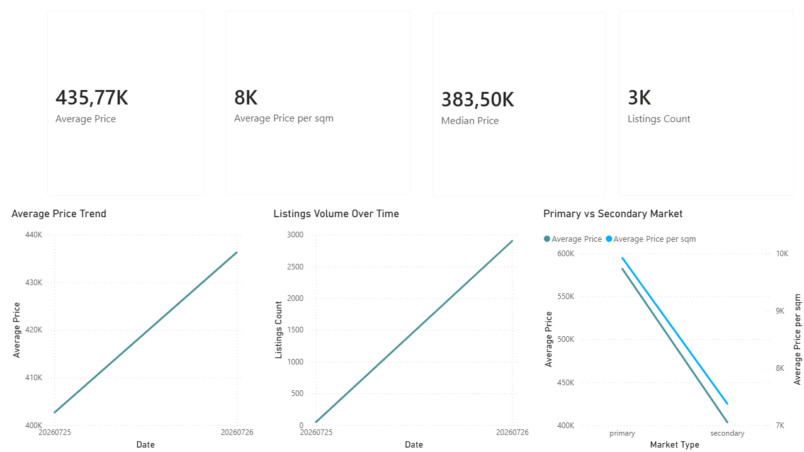
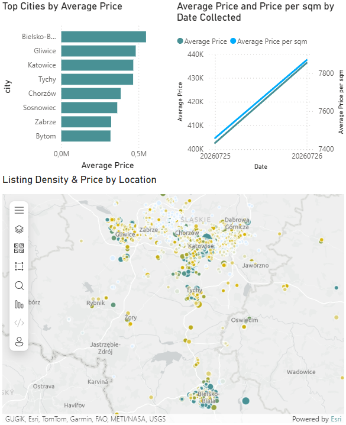

# Silesia Housing Data Platform

End-to-end data engineering pipeline for the residential real estate market in the Silesian Voivodeship, Poland — built as a production-style portfolio project, not a tutorial. Covers ingestion, orchestration, infrastructure-as-code, data quality, dimensional modeling, CI/CD, and BI reporting for eight major Silesian cities.

[](https://github.com/kromylodd/Silesia-Housing-Data-Platform/actions/workflows/ci.yml)

**Status: complete end-to-end.** Scraper → Great Expectations → GCS → BigQuery raw → dbt (staging → dims/fact → marts) → CI/CD → Power BI are all built, tested, and running against live data.

## Table of Contents

- [Motivation](#motivation)
- [Current Progress](#current-progress)
- [Tech Stack](#tech-stack)
- [Architecture](#architecture)
- [Project Structure](#project-structure)
- [Pipeline Walkthrough](#pipeline-walkthrough)
- [Data Model (Star Schema)](#data-model-star-schema)
- [CI/CD](#cicd)
- [Dashboard (Power BI)](#dashboard-power-bi)
- [Example SQL Queries](#example-sql-queries)
- [Target Cities & Known Data Quality Notes](#target-cities--known-data-quality-notes)
- [Scraping Ethics](#scraping-ethics)
- [Running Locally](#running-locally)
- [Testing](#testing)
- [Roadmap / Future Improvements](#roadmap--future-improvements)
- [Disclaimer](#disclaimer)

## Motivation

Most portfolio ETL projects stop at "scrape and dump to CSV." This one is built the way a real internal analytics platform at a real estate company would be: validated ingestion with a hard quality gate, infrastructure defined entirely as code, orchestrated daily runs with per-city observability, a proper Kimball-style star schema, CI enforcing lint/tests/data-quality on every push, and a BI layer on top. Scope is deliberately capped at 8 of Silesia's largest cities for the MVP — full regional coverage and stretch features (ML pricing, geospatial analysis) are documented in the [Roadmap](#roadmap--future-improvements) rather than chased prematurely.

## Current Progress

| Layer | Status |
|---|---|
| Scraper (OLX GraphQL, paginated, retry/backoff) | ✅ Done |
| Parser (typed field extraction, PL-language normalization) | ✅ Done |
| Local raw storage (partitioned by city/date) | ✅ Done |
| Terraform (GCS bucket, BigQuery datasets, service accounts, IAM) | ✅ Done |
| Docker Compose (Airflow 2.10.5 webserver/scheduler + Postgres) | ✅ Done |
| Great Expectations gate (critical + warning suites, unit tested) | ✅ Done |
| GCS raw landing zone | ✅ Done |
| Airflow DAG (scrape → validate → upload → load, daily, per-city selective run) | ✅ Done |
| BigQuery raw table (`raw_apartment_listings`, partitioned + clustered) | ✅ Done |
| dbt staging layer (`stg_listings`) | ✅ Done |
| dbt dimensional model (5 dims + `fact_apartments`) | ✅ Done |
| dbt marts (price stats, city/district summaries, market trends) | ✅ Done |
| GitHub Actions CI (lint, test, docker-build, dbt build/test) | ✅ Done |
| Power BI dashboard (3 pages, 12 DAX measures, ArcGIS map) | ✅ Done |
| dbt snapshots (price-change history) | ⬜ Not started |
| Full Silesian city list expansion | ⬜ Not started |

## Tech Stack

| Category | Tools |
|---|---|
| Language | Python 3.12 |
| Warehouse | Google BigQuery |
| Storage | Google Cloud Storage |
| Orchestration | Apache Airflow 2.10.5 (Docker Compose, LocalExecutor + Postgres) |
| Data Quality | Great Expectations 1.19.1 (fluent/code-first API) |
| Transformation | dbt-core + dbt-bigquery, dbt-utils |
| Infra as Code | Terraform |
| Containerization | Docker / Docker Compose |
| CI/CD | GitHub Actions |
| Visualization | Power BI Desktop (ArcGIS Maps for Power BI) |

## Architecture

```
OLX listings (GraphQL API, category_id=14, sale listings)
   ↓
Python scraper — paginated, rate-limited, retry/backoff (scraper/scrapper.py)
   ↓
Local raw JSON — data/raw/{city}/{date}/listings.json (scraper/loader.py)
   ↓
Great Expectations validation gate — critical suite blocks, warning suite logs (great_expectations/validate_batch.py)
   ↓
GCS raw landing zone — raw/{city}/{date}/listings.json (scraper/gcs_uploader.py)
   ↓
BigQuery raw table — raw_apartment_listings, partitioned on date_collected, clustered on source_city (scraper/bq_loader.py)
   ↓
dbt staging — stg_listings (dedup, city standardization, sanity filters)
   ↓
dbt dimensional model — dim_city / dim_district / dim_building_type / dim_market / dim_date → fact_apartments
   ↓
dbt marts — mart_price_statistics, mart_city_summary, mart_district_summary, mart_market_trends
   ↓
Power BI dashboard — Overview / Market / Geo pages
```

Orchestrated daily via a single Airflow DAG, one task chain per city: `scrape → validate → upload → load_bq`. All GCP infrastructure (bucket, datasets, service accounts, IAM bindings) is provisioned via Terraform — nothing is created manually in the GCP console.

## Project Structure

```
housing-data-platform/
├── scraper/
│   ├── scrapper.py           # fetch + orchestrate per-city scraping (OLX GraphQL)
│   ├── parser.py              # flatten + type raw GraphQL items, PL-value normalization
│   ├── loader.py               # write partitioned local raw JSON
│   ├── gcs_uploader.py          # push validated batch to GCS
│   ├── bq_loader.py               # load GCS batch into BigQuery raw table
│   ├── requirements.txt
│   └── tests/
├── great_expectations/
│   ├── validate_batch.py      # critical + warning expectation suites
│   └── tests/
├── airflow/
│   └── dags/
│       └── housing_pipeline_dag.py
├── docker/
│   └── airflow/
│       ├── Dockerfile          # apache/airflow:2.10.5-python3.12 + GCP deps
│       └── requirements.txt
├── docker-compose.yml           # postgres + airflow-init + webserver + scheduler
├── terraform/
│   ├── providers.tf / versions.tf / apis.tf
│   ├── variables.tf / outputs.tf / terraform.tfvars.example
│   ├── storage.tf              # GCS raw bucket, 90-day lifecycle
│   ├── bigquery.tf              # raw / staging / marts datasets
│   └── iam.tf                    # ingestion + dbt service accounts, least-privilege IAM
├── dbt/
│   ├── dbt_project.yml
│   ├── profiles.yml              # connection config from env_var() only, no secrets committed
│   ├── packages.yml               # dbt_utils 1.3.0
│   ├── macros/
│   │   └── get_custom_schema.sql   # maps +schema to Terraform datasets exactly, no suffixing
│   ├── seeds/
│   │   └── city_lookup.csv          # source_city slug → standardized display name
│   └── models/
│       ├── staging/
│       │   ├── _staging__sources.yml
│       │   ├── _staging__models.yml
│       │   └── stg_listings.sql
│       ├── intermediate/
│       │   └── int_listings_daily.sql   # ephemeral, daily grain for market-trend mart
│       └── marts/
│           ├── dim_city.sql / dim_district.sql / dim_building_type.sql
│           ├── dim_market.sql / dim_date.sql
│           ├── fact_apartments.sql
│           └── mart_price_statistics.sql / mart_city_summary.sql
│               mart_district_summary.sql / mart_market_trends.sql
├── .github/workflows/
│   └── ci.yml                     # lint, test, docker-build, dbt build (4 jobs)
└── keys/                          # gitignored — service account key files
```

## Pipeline Walkthrough

### Scraper (`scraper/scrapper.py`)
Queries OLX's GraphQL search endpoint (`ListingSearchQuery`, `category_id: 14` for sale listings) per city, paginating until results run out. Exponential-backoff retries on request failure, randomized delay between requests and between cities to keep load light.

### Parser (`scraper/parser.py`)
Flattens OLX's nested `params` array into a typed record. Handles Polish-language values at the source (area strings like `"48,5 m²"` → `48.5`, top-coded categories like `"4 i więcej"` / `"Powyżej 10"` → capped numeric value + a `rooms_capped`/`floor_capped` boolean so the topcoding is never silently lost), and computes `price_per_sqm_listed` directly from OLX's own fields for later cross-validation.

### Loader (`scraper/loader.py`)
Writes parsed listings to a locally partitioned directory (`data/raw/{city}/{date}/listings.json`) — the shared handoff point for Great Expectations, the GCS uploader, and local debugging.

### Great Expectations gate (`great_expectations/validate_batch.py`)
Sits between the local raw write and the GCS upload. Two suites, run against every city's batch:
- **Critical suite** (blocks the pipeline on failure): ID not-null/uniqueness, price bounds (1–20,000,000 PLN), area bounds (10–500 m²), room count bounds (1–10, `mostly=0.95` to allow a small outlier margin), boolean honesty on the topcoded fields (`rooms_capped`/`floor_capped` must be real booleans, never null), valid `market_type`, and a cross-field check that OLX's listed price/m² agrees with `price / area_sqm` within 5% — this catches parsing bugs a plain range check would miss.
- **Warning suite** (logged, never blocks): `district` not-null rate. Deliberately informational — a real Katowice run showed ~40% missing, which is a property of the source data (OLX doesn't always tag a district), not a scraper bug.

Code-first, no persisted GX project, since it runs inside a scheduled Airflow container.

### GCS uploader (`scraper/gcs_uploader.py`)
Uploads a validated city's local raw file to the GCS landing zone (`raw/{city}/{date}/listings.json`), only after the GE critical suite passes.

### BigQuery loader (`scraper/bq_loader.py`)
Reads the just-uploaded GCS blob (not the local file, so BigQuery mirrors exactly what's in the landing zone) and appends it into `raw_apartment_listings`. Table is created on first run, partitioned daily on `date_collected`, clustered on `source_city`, `WRITE_APPEND`.

### Airflow DAG (`airflow/dags/housing_pipeline_dag.py`)
One `scrape → validate → upload → load_bq` chain per city, scheduled `@daily` with `catchup=False`. Exposes a `cities` Param on the Trigger UI form so a subset (e.g. just `["katowice"]`) can be run on demand for testing — other cities' chains still appear in the graph but cascade-skip cleanly via `AirflowSkipException` rather than being removed.

### Infrastructure (`terraform/`)
Provisions the GCS raw bucket (90-day lifecycle rule — BigQuery is the source of truth post-load, so raw JSON doesn't need to live forever), three BigQuery datasets (`raw_housing`, `staging_housing`, `marts_housing`), and two service accounts with least-privilege IAM: an ingestion SA (`storage.objectAdmin` on the raw bucket, `bigquery.dataEditor` on raw, `bigquery.jobUser`) and a dbt SA (`bigquery.dataViewer` on raw, `bigquery.dataEditor` on staging + marts, `bigquery.jobUser`).

### dbt staging (`dbt/models/staging/stg_listings.sql`)
Sits on top of the `raw_apartment_listings` source, one row per listing deduplicated to its most recent scrape (`qualify row_number() over (partition by listing_id order by date_collected desc) = 1` — the same listing recurs across days since raw is append-only). Standardizes city names via a `city_lookup` seed keyed on `source_city` (the reliable scrape-target field — see [Known Data Quality Notes](#target-cities--known-data-quality-notes)), and applies a second, defensive price/area sanity filter on top of what GE already gated upstream.

### dbt dimensional model & marts (`dbt/models/intermediate/`, `dbt/models/marts/`)
`fact_apartments` (one row per `listing_id`, current-state grain) joins to five dimensions — `dim_city`, `dim_district`, `dim_building_type`, `dim_market`, and a generated `dim_date` spine (2010-01-01 through one year ahead) — via surrogate keys built with `dbt_utils.generate_surrogate_key`. `mart_market_trends` is built from a separate ephemeral model, `int_listings_daily`, deliberately *not* `stg_listings` — the staging model collapses to latest-scrape-only, which would flatten every trend point to the same value, so the trend mart reads straight from the append-only raw table to preserve one row per scrape day.

A custom `generate_schema_name` macro (`dbt/macros/get_custom_schema.sql`) makes each layer's `+schema` config map to its Terraform-provisioned dataset exactly (`staging_housing`, `marts_housing`), rather than dbt's default of appending it as a suffix onto the target schema.

## Data Model (Star Schema)

```
                         dim_city ──┐
                    dim_district ───┤
               dim_building_type ───┼──▶ fact_apartments ──▶ mart_price_statistics
                     dim_market ────┤         │               mart_city_summary
                       dim_date ────┘         │               mart_district_summary
                                               │
                                   int_listings_daily ──▶ mart_market_trends
```

**`fact_apartments`** — one row per listing: `price`, `area_sqm`, `price_per_sqm_calculated`, `num_rooms` (+ `rooms_capped`), `floor` (+ `floor_capped`), `is_furnished`, `extra_rent_pln`, lat/long, plus FKs to all five dimensions (`city_key`, `district_key`, `building_type_key`, `market_key`, `date_collected_key`, `date_published_key`).

All FK relationships are enforced with dbt `relationships` tests, and every dimension's surrogate key has `unique` + `not_null` tests — 25+ dbt tests total across staging and marts, all passing against live BigQuery data.

## CI/CD

`.github/workflows/ci.yml` — four jobs on every push/PR to `main`:

| Job | What it does |
|---|---|
| `lint` | `ruff check .` + `black --check .` |
| `test` | `pytest scraper/tests/` (parser + scraper unit tests) and `pytest great_expectations/tests/` (GE suite unit tests) |
| `docker-build` | Builds the Airflow image from `docker/airflow/Dockerfile` — catches Dockerfile/dependency breakage before it hits the running environment |
| `dbt` | `dbt build` against the real BigQuery project — gated to `needs: [lint, test]` and `push` to `main` only, so PRs get fast lint/test feedback without touching production tables. This job is effectively the CD half: every merge to `main` re-materializes the warehouse |

## Dashboard (Power BI)

Built in Power BI Desktop, connected to `marts_housing` in Import mode (`fact_apartments` + all 5 dimensions), with `fact_apartments.date_collected_key` → `dim_date.date_key` as the active relationship driving all time-series visuals. 12 DAX measures with custom number formats (e.g. `#,##0, "K"zł`) to keep price formatting locale-independent. Two pages:

- **Overview** — KPI cards (average price, average price/m², median price, listings count), an average-price trend line, a listings-volume-over-time line, and a primary-vs-secondary-market comparison chart driven by `dim_market`.

  
  *Prices are in PLN with Polish number formatting (comma as decimal separator, e.g. `435,77K` = 435.77 thousand PLN). Trend lines show only two points — see known limitation below.*

- **Market & Geo** — a Top Cities by average price bar chart, an average-price-and-price-per-sqm-by-date-collected dual-axis line chart, and apartment locations plotted with the ArcGIS Maps for Power BI visual (used instead of Azure Maps, which requires a Microsoft work/school account).

  
  *Listing density and pricing across the 8 MVP cities, colored by market type.*

A teal/gold Power BI theme is applied for consistent coloring across bars, lines, and the map.

**Known limitation:** trend charts are still building up daily history (three days as of this writing) since the Airflow scheduler runs inside Docker Compose on a personal machine rather than a continuously-available host, and the DAG's `catchup=False` means missed daily triggers aren't backfilled. Month-over-month/week-over-week growth measures will stay blank until more daily history accumulates — this is expected given the current deployment target, not a modeling bug.

## Example SQL Queries

Most expensive districts by average price/m² (excludes the `Unknown` sentinel):

```sql
select city, district, avg_price_per_sqm, rank_most_expensive
from `silesia-housing-data-platform.marts_housing.mart_district_summary`
where district != 'Unknown'
order by rank_most_expensive
limit 10;
```

Month-over-month price trend, all cities combined:

```sql
select period_start, avg_price, price_change_pct
from `silesia-housing-data-platform.marts_housing.mart_market_trends`
where period_type = 'month'
order by period_start;
```

Primary vs. secondary market split by city:

```sql
select
    dim_city.city,
    dim_market.market_type,
    count(*)          as num_listings,
    round(avg(fact_apartments.price_per_sqm_calculated), 2) as avg_price_per_sqm
from `silesia-housing-data-platform.marts_housing.fact_apartments` as fact_apartments
join `silesia-housing-data-platform.marts_housing.dim_city` as dim_city
    on fact_apartments.city_key = dim_city.city_key
join `silesia-housing-data-platform.marts_housing.dim_market` as dim_market
    on fact_apartments.market_key = dim_market.market_key
group by 1, 2
order by 1, 2;
```

## Target Cities & Known Data Quality Notes

Katowice, Gliwice, Zabrze, Bytom, Chorzów, Tychy, Sosnowiec, Bielsko-Biała — the eight largest Silesian cities, scoped down deliberately for MVP feasibility. Full regional coverage is on the [Roadmap](#roadmap--future-improvements).

- **`city` vs. `source_city`:** OLX's search API matches on free text, not a strict location filter, so the raw `city` field includes bleed from neighboring metro areas (Ruda Śląska, Mysłowice, etc.) and occasional unrelated noise. This is expected, not a scraper bug — `source_city` (the actual scrape target) is the reliable field for filtering to the 8 MVP cities, and `stg_listings` standardizes `city` itself via the `city_lookup` seed.
- **`district` nulls:** legitimately variable by city (see the GE warning suite above) — kept as a permanent warning-suite check rather than a hard-fail threshold, and modeled as `'Unknown'` in `dim_district` rather than dropped.

## Scraping Ethics

- Only publicly visible listing metadata is collected via OLX's own GraphQL API — no authenticated endpoints, no HTML scraping.
- Requests are rate-limited with randomized delays (1.5–3.5s between pages, 5–10s between cities).
- Failed requests retry with exponential backoff rather than hammering the endpoint.
- No attempt is made to bypass access controls, CAPTCHAs, or ToS restrictions. Scope is limited to search-results-page fields only — no detail-page scraping.

## Running Locally

```bash
# 1. Provision GCP infrastructure
cd terraform
terraform init && terraform apply

# 2. Bring up Postgres + Airflow (webserver + scheduler)
cd ..
docker compose up -d

# 3. Open the Airflow UI at localhost:8080, trigger `housing_pipeline`
#    (optionally trim the `cities` param to run a subset, e.g. ["katowice"])

# 4. Run dbt — separate Python 3.12 env, dbt isn't bundled in the Airflow image
python3.12 -m venv ~/venvs/housing-dbt && source ~/venvs/housing-dbt/bin/activate
pip install dbt-core dbt-bigquery
cd dbt
export DBT_PROFILES_DIR=$(pwd)
export GCP_PROJECT_ID=silesia-housing-data-platform
export BQ_DATASET_STAGING=staging_housing
export GCP_REGION=europe-central2
export DBT_KEYFILE_PATH=../keys/dbt-key.json   # housing-dbt-sa key — see terraform/iam.tf
dbt deps && dbt seed && dbt build

# 5. Connect Power BI Desktop to the marts_housing dataset via the BigQuery
#    connector (Import mode) to reproduce the dashboard.
```

## Testing

```bash
cd scraper
pip install -r requirements.txt
pytest tests/ -v

cd ../great_expectations
pytest tests/ -v
```

**Python version note:** Great Expectations 1.19's fluent API (`context.data_sources`) requires Python < 3.14. On a host with a newer default Python, `pip install great_expectations` silently falls back to an old pre-fluent release and breaks the GE tests — use a Python 3.12 virtualenv (or run the tests inside the Airflow container, which is pinned to `apache/airflow:2.10.5-python3.12`) instead of fighting a bleeding-edge system Python.

## Roadmap / Future Improvements

- dbt snapshots for price-change history (type-2 tracking of price changes per listing over time)
- Expansion to the full Silesian city list (Rybnik, Jaworzno, Dąbrowa Górnicza, Mysłowice, Siemianowice Śląskie, Żory, Czeladź, Piekary Śląskie, Świętochłowice)
- Detail-page scraping (construction year, parking, balcony, elevator, seller/agency info) — deliberately deferred; MVP scope is search-results fields only
- ML price prediction model
- Geospatial analysis (distance to city center, schools, public transport; OpenStreetMap integration)
- Continuous (cloud-hosted) Airflow scheduling so trend marts accumulate daily history instead of running on-demand

## Disclaimer

This project scrapes only publicly available data for educational/portfolio purposes. It is not affiliated with OLX or Otodom.
